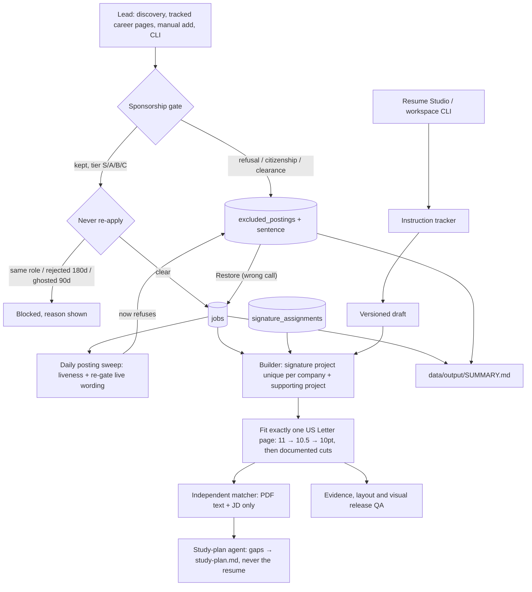

# Career agent system: architecture and end-to-end workflow

Updated 18 September 2026 for Annie Prasanna Manoharan's US edition. This describes the implemented local application and its limits. Start it with `Start Dashboard.command` in the repo root (or `python run.py` inside `backend/`).

## What the system does

The orchestrator coordinates small workers and records their progress. Routine work is deterministic Python: the sponsorship gate, the never-re-apply rules, the tracked-career-page feed reader, saving instructions, ranking projects, fitting the one-page PDF, scoring document vocabulary and monitoring runs. Optional AI is reserved for public research, discovery, instruction interpretation, qualitative document review, study plans and email interpretation. Completed AI stages are cached and reused.

All mutable state lives in **`career-dashboard/data/career.db`**. The UI and the CLIs share `Workspace` and `CareerServices`; there is no second job database. The current candidate revision is **2026-09-18.1** (Q1 Soliton dates and Q4 Dräger attribution answered that day; the publication claim `PUB-001` stays on hold; no total years of experience is ever stated).

## Architecture at a glance



## Workers and boundaries

| Worker | Inputs | Result | AI cost |
|---|---|---|---|
| Sponsorship gate (`services/sponsorship.py`) | Posting text, company, URL, location, quoted restriction | Tier S/A/B/C or EXCLUDED with the exact sentence; H-1B history from the USCIS index | None |
| Re-apply rules (`services/reapply.py`) | Company, title, job history, excluded log, archived history | Blocked (`same_role`, `rejected_180`, `ghosted_90`) or clear; hourly ghosting after 21 quiet days | None |
| Tracked career pages (`services/portals.py`) | `data/config/portals.yml` | Greenhouse/Lever/Ashby postings through the same gates | None |
| Posting sweep (`job_quality.verify_due`) | Saved postings | Active/expired/needs review; live wording re-gated | None |
| Main orchestrator | Job ID, draft revision, worker states | Queued/running/completed/failed runs with progress | None |
| Assistant agent (`services/assistant.py`, tools in `services/assistant_tools.py`) | One message thread for the whole workspace: the snapshot, the tool catalogue and the task transcript | A pasted posting → gate, save, draft, one-page fit, score, PDF without a model; any other request → an agent loop (one structured decision per turn: call a tool, ask, or reply) over tools that wrap every feature, pausing for her yes before anything hard to undo | None for postings and shortcuts; one cheap call to read an unlabelled posting; one strong call per agent turn (at most 14 per message), on Claude Code, Codex or a keyed provider |
| Instruction tracker | Chat messages, selected draft | Applied edit, pending profile fact, clarification or error, all retained | None |
| Project ranker / builder | Saved JD, registry, signature ownership | Signature + supporting project slots, evidence-linked draft | None |
| Layout fitter | Saved source | Measured one-page PDF and preview; cuts in the documented order | None |
| Document matcher | Current PDF text and saved JD | Term coverage with excerpts and gaps | None |
| Discovery | Profile targets, seen jobs | Verified US postings with verbatim `restriction_quote` and `employer_type` | Live, budgeted |
| Company researcher / hiring manager / resume advisor | JD and public research (hiring manager and advisor get no profile) | Dated research and expectations | Cached |
| Study planner | JD, match gaps, registered skill/project titles, never-claim list | `study-plan.md` (tiers, proof artifacts, build-now spec) | Cached |
| Email reviewer | Scoped Gmail read tools | Application evidence | Live, budgeted |
| Release validator | Source, registry, evidence map, PDF, preview | Hard pass/fail gates | None |

AI workers run as fresh Claude Code, Codex or Kimi Code CLI processes in temporary directories with shell tools disabled, or through an API provider chosen in Settings. Codex's structured output is strict, so every schema reaches it in closed form (`backend/ai/codex.py: strict_schema`: objects closed, every property required); a failed `codex exec` reports its last error line rather than a generic hint. One choice covers everything: the chat's tiers follow the main provider unless Settings set them apart, and a run the chat starts is enqueued on the chat's engine when that runtime can do the work. The hiring manager never receives candidate context.

## How to use the workflow

The Assistant tab is the front door: paste a posting with its link and the steps below run in order, reporting each stage; the reply carries the PDF, *Open in Resume Studio* and the next commands (study plan, research, applied). Anything else is a task for the agent, which chains the same tools the tabs use and reports each one as a step; the rail beside the thread shows the runtime it runs on, the live flow of agents behind the current task, the runs in progress and every agent with whether the chat reaches it (the Gmail sync stays on the Agents tab). Messages belong to conversations: *New chat* opens a fresh thread (the old one stays in the history), and the agent's memory of recent exchanges covers only the open thread. *Stop* ends a reply at its next step boundary; a model decision that arrives after the stop is dropped, so no tool runs and no reply shows. The tabs remain for looking closely at anything the chat did.

1. **Daily Search → Find suitable jobs.** Every lead passes the sponsorship gate and the re-apply check before it is saved; excluded postings appear under Dashboard → Excluded roles with their sentence.
2. Open a saved job: tier badge and reason, **Re-check sponsorship**, company & hiring review.
3. **Resume Studio.** Opening a draft spends no AI. The signature project is the best-ranked project no other company owns; the supporting project follows. **Sync profile & rank projects** re-ranks both slots from the registry.
4. Edit through the chat or the editor. **Fit to one page** ranks content for the role's track (A/C Experience first, B/D Projects first), tries 11, 10.5 and 10pt, then cuts content in the documented order. It never goes below 10pt or changes margins.
5. **Build & score**, then read the matched excerpts and gaps. **Write study plan** turns the gaps into `study-plan.md`.
6. Complete role eligibility, the evidence map and the visual review before release. A built draft is never an application.

### Instruction examples

| Message | Effect |
|---|---|
| `skills: Python, SQL, C#, C++` | Replaces the Languages line; new terms are captured for evidence review |
| `skills data: Apache Kafka, Apache Flink, Airflow` | Replaces the Data Engineering line (`skills ml:` and `skills cloud:` likewise) |
| `coursework: Machine Learning, Data Mining` | Replaces the coursework line |
| `project: PROJ-P02-MIGA` | Changes the signature project (refused if another company owns it, or it is supporting-only) |
| `second project: PROJ-P04-NEWS-RAG` | Changes the supporting project |
| `font: 10.5` | Body type 10–11pt only; `font: auto` restores automatic fitting |
| `experience: …` / `note: …` | Saves a Profile fact for reconciliation |
| `help` | Shows the grammar |

## One page, two projects

The registry holds the project library. The signature slot (`SelectedProject…` macros) and the supporting slot (`SecondProject…`) each carry evidence comments and registry wording. `signature_assignments` records which company owns which signature; `data/signature-projects.md` is its projection. Projects registered `signature_eligible: false` (Pacman coursework) can only support.

The fitter accepts exactly one US Letter page with at least 80% measured fill, bounded bottom whitespace and internal gaps, and 10–11pt body type. When the page overflows at 10pt it cuts, in order: the supporting project's third bullet, the last bullet of the oldest role, the coursework line, the second degree. If it still cannot fit, it fails and preserves the previous version.

## Matching score

**JD term coverage** is `100 × matched weight / detected weight`, with excerpts from the JD and the PDF. It does not establish proficiency, years of experience or work rights, and it is **not an ATS score or hiring probability**. Supported requirement coverage in the evidence map and binary artifact QA are separate.

## Saving AI credits

- Default local limit: **6 AI invocations per US Central calendar day**, editable from 0 to 50 in Agent control. Zero uses free workers and cached results only.
- The tracked-career-pages mix makes no AI call at all.
- Cache lookup happens before budget reservation. Web research expires after seven days.
- Discovery and email calls stay live; their results live in run, job and mail history.
- One orchestrator worker executes at a time; interrupted runs become failed on restart and can be retried.

## Storage and implementation map

| Location | Owns |
|---|---|
| `backend/services/sponsorship.py` | The gate, tiers, cap-exempt signals, USCIS index |
| `backend/services/reapply.py` | Never-re-apply rules and ghosting |
| `backend/services/portals.py` | Greenhouse/Lever/Ashby feed reader |
| `backend/resume_contract.py` | The one-page US Letter contract every validator and the fitter read |
| `backend/services/agents.py` | Orchestrator, discovery loop, study-plan worker, scheduler |
| `backend/services/workspace_v2.py` | add_posting (gate → duplicates → re-apply → save), excluded log, restore, Profile, goals, email |
| `backend/services/resume_studio.py` | Drafts, signature enforcement, one-page fit and cuts, compilation, scoring |
| `backend/services/resume_layout.py` | Track detection, relevance ordering, typography, page measurement |
| `backend/scripts/validate_resume.py` / `validate_batch.py` / `validate_workspace.py` | Release and workspace checks |
| `frontend/src/components/JobList.tsx` | Tier badges, tier filter and ordering |
| `frontend/src/features/Dashboard.tsx` | Excluded roles with sentences and Restore |

New tables (migrations 5–6): `excluded_postings`, `signature_assignments`, `reapply_history`; new job columns `sponsor_tier`, `sponsor_evidence`. The database snapshot before the first migration is kept under `data/migrations/`.

## API and CLI

Under `/api/v2`: `POST /jobs` (returns `excluded`, `blocked`, `duplicate` or the saved job with its tier), `GET /excluded`, `POST /excluded/{id}/restore`, `POST /jobs/{id}/sponsorship`, `POST /jobs/age`, `POST /jobs/verify-due`, `POST /studio/{id}/fill` (fits one page), `POST /agents/run` with `study_plan` among the kinds. See [API.md](API.md).

```sh
backend/.venv/bin/python backend/scripts/workspace.py run --kind discovery --preset portals
backend/.venv/bin/python backend/scripts/workspace.py sponsor-check --company "Acme" --file JD.txt
backend/.venv/bin/python backend/scripts/workspace.py check-reapply --company "Acme" --title "Data Engineer"
backend/.venv/bin/python backend/scripts/workspace.py run --kind study_plan --job-id EXACT_ID
backend/.venv/bin/python backend/scripts/workspace.py send-instruction --job-id EXACT_ID --revision 3 --message 'font: 10.5'
```

## Verification and limits

Run `./Check Workspace.command` after changes. Tests use disposable workspaces and mock AI; real PDF tests compile and render locally with Tectonic.

Deliberate limits: the gate reads the posting's own words and cannot know an unstated policy (silence is shown, never excluded); the chat grammar is finite; one-page fitting can fail for unusually long custom text; role eligibility and visual approval are human gates. No application submission or outreach is part of this system.
